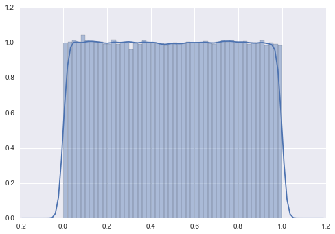
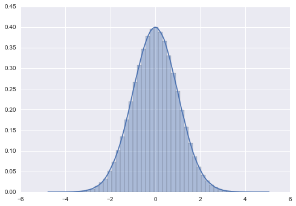

pg-utils: PostgreSQL Utils
==========================

.. image:: https://badge.fury.io/py/pg-utils.svg
    :target: https://badge.fury.io/py/pg-utils

.. image:: https://readthedocs.org/projects/pg-utils/badge/?version=latest
    :target: http://pg-utils.readthedocs.org/en/latest/?badge=latest
    :alt: Documentation Status

When analyzing large datasets, it can often be useful to let the database do as much of the analysis as possible. While `Pandas is great at manipulating datasets that are large enough to fit on one machine, but possibly not large enough to fit into memory <http://stackoverflow.com/a/14268804/554546>`_, concerns over performance and data security can sometimes make analysis in the database more convenient.

This package is built for use with PostgreSQL. Support for other databases *might* follow (but don't hold your breath).

Wait, what? Why?!?
------------------

Let's illustrate with a few examples. To begin with, making a connection is simple:

::

    In [1]: from pg_utils import connection, table

    In [2]: conn = connection.Connection()

The environment variables ``pg_username``, ``pg_password``, ``pg_hostname``, and ``pg_database`` can be used to store values for the corresponding connection information. Of course, any of the username, password, hostname, or database can be overridden.

Moving on, let's build a simple table consisting of one million rows with one column chosen randomly and another sampled from the standard normal distribution (via the `Box-Muller transform <https://en.wikipedia.org/wiki/Box%E2%80%93Muller_transform>`_).

::

    In [1]: from pg_utils import table

    In [2]: t = table.Table.create("pg_utils_test",
       ...:         """create table pg_utils_test as
                        select random() as x,
       ...:             sqrt(-2 * ln(u1))*cos(2*PI()*u2) as y
       ...:             from(
       ...:                 select random() as u1, random() as u2
       ...:                 from generate_series(1, 1000000)
       ...:             )a""")

The object ``t`` is a metadata object. It doesn't hold any of the actual data within the table. However, we have a limited subset of the Pandas API that works via the database. For example:

::

    In [3]: t.describe()
    Out[3]:
                          x               y
    count    1000000.000000  1000000.000000
    mean           0.499628       -0.000075
    std_dev        0.288671        0.999630
    minimum        0.000001       -4.589661
    25%            0.249420       -0.672603
    50%            0.499709        0.000695
    75%            0.749733        0.673413
    maximum        0.999999        4.867347

Note that *none* of those calculations are done locally. They're all done in the database.

Also, ``t.x.distplot(bins=1000)`` and ``t.y.distplot(bins=1000)`` produce the following histograms (with KDEs):

Note
----

The ``Table`` API has significantly changed from ``0.3.x`` to ``0.4.0``. In particular, schema and connection parameters are now optional (replaced with your username and a fresh connection, respectively). This leaves the table name as the only required parameter for many of these methods. If ``table_name`` is already qualified with a schema (eg ``"foo.bar"``), then pg-utils will Do The Right Thing and just set ``schema="foo"`` and ``table_name="bar"``.

Goals
-----

The goals for this package are:

* Providing a simple ``Connection`` object that builds easy connections to the database based off of environment variables (overridden with parameters, if specified).

* Mocking Pandas Series and DataFrame objects with metadata constructs of ``Column`` and ``Table`` (respectively). Columns and Tables will implement some parts of the Pandas API that do calculations in the database.

* Possibly other tools for automation of simple tasks and conveniently displaying metadata (if needed).

Non-Goals
---------

This package will never be:

* An object-relational mapper (ORM). The only SQL-ish operations will be those that are implemented and that mock SQL-ish bits of the Pandas API for Series and/or DataFrames.

Installation
------------

It's up on PyPI. So, just do

::

    pip install pg-utils

for the base package, or

::

    pip install pg-utils[graphics]

to install `Seaborn <https://stanford.edu/~mwaskom/software/seaborn/>`_ for graphical visualizations.

